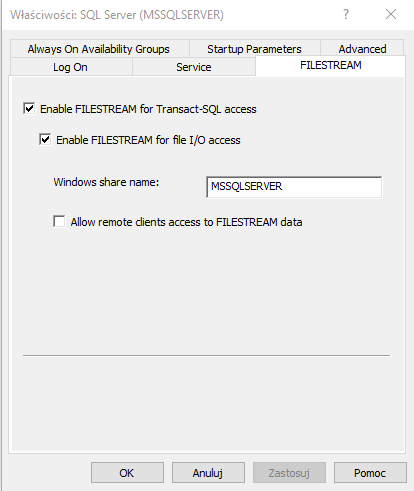

# RMSBD

##Introduction

Due to the bug in the docker image we could not use docker for this task. SQL Server Express was used instead. 

Image processing was implemented using built-in python environment which is a part of the SQL Server Machine Learning Services - the add-on has to be installed for the project to work properly. 

Additionally, you have to enable FILESTREAM for t-sql. To do this, launch SQL Server Configuration Manager, open SQL Server properties and set them as in the picture below:

Notice, to load and save files you have to have all the required permissions on said folders and files.  

##Usage

The project has the following folders:
* _sql_scripts_ folder has all the files that set up the database - **files should be launched in alphabetical order**
* _sql_scripts_manual_ folder has a file with usage examples
* _images_ folder contains the pictures used in the files

**Before launching SQL code you should change all the paths in files!**